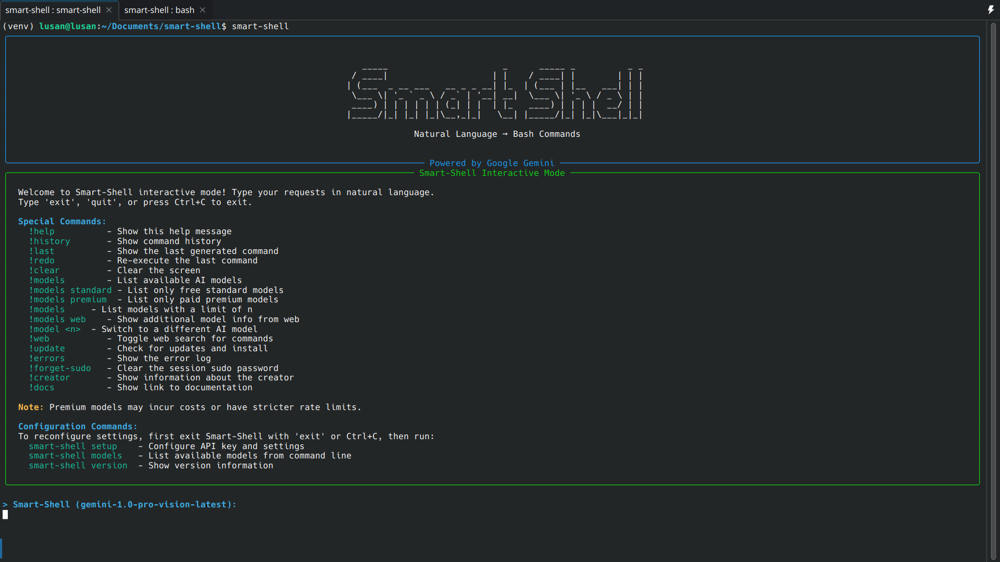

# Smart-Shell Documentation

Welcome to the official documentation for **Smart-Shell** - the intelligent AI-powered terminal assistant!



[](https://github.com/Lusan-sapkota/smart-shell)
[](license.md)
[](https://www.python.org/)
[](https://ai.google.dev/)

> **Smart-Shell is in active development.** Version 1.1.0 coming soon with offline mode and enhanced safety features!

## 🌟 What is Smart-Shell?

Smart-Shell is an advanced AI-powered terminal assistant that converts natural language into executable Bash/Zsh commands using Google's Gemini AI models. It features comprehensive safety systems, interactive command management, and intelligent error handling.

### ✨ Key Highlights

- 🧠 **Natural Language Processing**: Convert plain English to shell commands
- 🛡️ **Advanced Safety System**: 4-tier risk classification with user confirmation
- 🐚 **Multi-Shell Support**: Works with both Bash and Zsh
- 🔧 **Interactive Mode**: Rich REPL with command history and special commands
- 🌐 **Web Search Integration**: Real-time web search for enhanced accuracy
- 🔐 **Privacy-First**: Upcoming offline mode for complete data control
- 📱 **Desktop Integration**: Launch from your application menu

## 🚀 Quick Start

### One-Command Installation

```bash
curl -sSL https://raw.githubusercontent.com/Lusan-sapkota/smart-shell/main/install.sh | bash
```

The installation script automatically:

- ✅ Installs all required dependencies
- ✅ Sets up Smart-Shell with pipx for isolated environment
- ✅ Creates desktop entries and command completion
- ✅ Runs the setup wizard for API key configuration

### First Steps

1. **Start Smart-Shell:**
   ```bash
   smart-shell
   ```

2. **Configure your API key** (first run only):

   ```bash
   smart-shell setup
   ```

3. **Try some commands:**
   - "list all files in the current directory"
   - "show system memory usage"
   - "create a new directory called project"

### Need Help?

- 📖 **New to Smart-Shell?** Start with our [Usage Guide](usage.md)
- 🔧 **Having issues?** Check the [FAQ](faq.md)
- 🛠️ **Want to contribute?** See [Development Guide](DEVELOPMENT.md)

## 📚 Documentation Sections

### 🎯 Getting Started

- **[Features](features.md)** - Complete feature overview and capabilities
- **[Installation](installation.md)** - Detailed installation options and troubleshooting
- **[Usage](usage.md)** - Step-by-step usage guide with examples
- **[Uninstall](uninstall.md)** - Complete removal instructions

### 🛡️ Safety & Security

- **[Safety](safety.md)** - Understanding the safety system and risk levels
- **[FAQ](faq.md)** - Common questions and troubleshooting

### 🔧 Advanced & Development

- **[API Reference](api.md)** - Technical API documentation
- **[Development Guide](DEVELOPMENT.md)** - Contributing and development setup
- **[Contributing](contributing.md)** - How to contribute to the project

### 📋 Project Information

- **[Future Changes (v1.1.0)](futurechanges.md)** - Upcoming features and roadmap
- **[Changelog](CHANGELOG.md)** - Version history and release notes
- **[License](license.md)** - Apache 2.0 license details
- **[Author](author.md)** - About the creator

## 🌍 Community & Support

### Get Help

- 💬 **GitHub Issues**: [Report bugs or request features](https://github.com/Lusan-sapkota/smart-shell/issues)
- 📚 **Documentation**: Comprehensive guides and examples
- 🤝 **Community**: Join discussions and share experiences

### Contributing

Smart-Shell is open source and welcomes contributions! Whether you're:

- 🐛 Reporting bugs
- 💡 Suggesting features  
- 📝 Improving documentation
- 💻 Contributing code

Check out our [Contributing Guide](contributing.md) to get started.

## 🔮 What's Coming Next?

Smart-Shell v1.1.0 will introduce groundbreaking features:

- 🚫 **Offline Mode**: Complete privacy with local LLM support
- 🔁 **Safe Continuous REPL**: Multi-step command execution
- 🛡️ **Enhanced Safety**: Advanced risk classification system

Learn more in our [Future Changes](futurechanges.md) documentation.

---

**Ready to get started?** Follow our [Installation Guide](installation.md) or visit the [GitHub repository](https://github.com/Lusan-sapkota/smart-shell) for more information.
